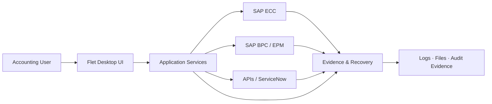

# Ramon Rodriguez

### Software Developer · Python · Automation · APIs · SAP · AI & Data

I build reliable software that turns complex business processes into maintainable, testable automation.

**Brazil · Open to remote international opportunities**

---

## About me

My background sits at the intersection of **software engineering, automation, enterprise systems, and accounting domain expertise**.

I started by solving real operational problems and gradually turned those solutions into structured software: reusable modules, SAP automations, API integrations, desktop applications, CI pipelines, automated tests, technical documentation, and production-oriented recovery flows.

Today, my main focus is **Python development, backend and API engineering, AI-assisted software development, automation, and quality-oriented engineering**.

I care about software that is not only able to run, but also able to be **understood, tested, reviewed, recovered, and maintained**.

---

## Engineering toolbox

  
  
  
  
  
  
  
  
  
  
  
  

**What I usually work on:** business automation · backend services · APIs · SAP integration · desktop tools · testing · CI/CD · technical documentation · AI-assisted engineering

---

## Selected impact

- Reduced selected enterprise accounting routines from **30–40 minutes to ~3 minutes per company** through automation.
- Helped remove **20+ person-hours of repetitive monthly work** across accounting operations.
- Evolved an internal automation platform into a structured software product with **2,754 passing automated tests**, CI, controlled releases, recovery mechanisms, and documented architecture.
- Built solutions that connect **Python, SAP ECC, SAP BPC/EPM, APIs, enterprise service workflows, filesystem operations, and evidence generation**.
- Applied software engineering practices to operational finance problems where reliability, traceability, and safe failure behavior matter as much as speed.

---

## BAS architecture at a glance

The diagram below is a **sanitized, high-level view** of the architecture. It intentionally excludes proprietary business rules, credentials, infrastructure details, and internal configuration.

The key design idea is to keep **business rules and orchestration outside the UI**, isolate integration concerns, and make execution recoverable and auditable.

---

## Selected engineering work

<table>
<tr>
<td width="50%" valign="top">

<h3>Business Accounting Suite (BAS)</h3>

  
  
  
  

A modular desktop automation platform built for enterprise accounting operations.
It grew from individual automation routines into a governed software product with reusable services, SAP integration, structured releases, automated testing, CI, recovery mechanisms, and technical documentation.

<strong>Engineering highlights:</strong> SAP GUI automation, SAP BPC/EPM, ServiceNow/WBS integration design, multi-session orchestration, evidence generation, controlled packaging, Spec-Driven Development, and production-oriented fail-safe behavior.

The current documented baseline reached <strong>2,754 passing automated tests</strong>, plus 275 skipped tests and 30 passing subtests in its final CI gate.

<em>Repository is private because it contains enterprise project material. This profile presents only a public technical summary.</em>

</td>
<td width="50%" valign="top">

<h3>Manolo Contabilidade</h3>

  
  
  
  

A production website built with <strong>Next.js 14, TypeScript, and Tailwind CSS</strong>, including a deployment workflow designed for real-world shared hosting constraints.

The project includes local production builds, cPanel packaging, PM2 process configuration, server startup scripts, deployment documentation, and operational maintenance procedures.

<em>Source repository is private. The live website is publicly available below.</em>

<a href="https://manolocontabilidade.com.br"><strong>Visit live website →</strong></a>

</td>
</tr>

<tr>
<td width="50%" valign="top">

<h3><a href="https://github.com/RamonRDR/fullstack-calculator">Full-Stack Calculator</a></h3>

  
  
  
  

A small full-stack application designed around correctness, readability, testability, and clear separation of concerns.

The React frontend communicates with a Go REST API while domain logic remains isolated from the HTTP layer. The repository includes validation, backend and frontend tests, technical design documentation, production builds, and GitHub Actions quality gates.

  
  

</td>
<td width="50%" valign="top">

<h3><a href="https://github.com/RamonRDR/python-study-guide">Python Study Guide</a></h3>

  
  
  

A multilingual Python learning and reference project built as a structured engineering repository rather than a loose collection of notes.

It combines concept explanations, practical examples, exercises, automated tests, practical projects, documentation standards, contribution guidelines, localization, and an explicit AI-assisted development workflow.

  
  

</td>
</tr>
</table>

---

## How I approach engineering

I tend to work from the problem outward:

- understand the business rule before automating it;
- separate domain logic from interfaces and infrastructure;
- make failures explicit instead of hiding them;
- create automated tests around critical behavior;
- use CI as evidence, not as a substitute for validation;
- document architectural decisions and operational constraints;
- design recovery and observability as part of the system, not as afterthoughts;
- use AI tools as engineering accelerators while keeping human review, testing, and accountability in the loop.

That mindset comes from working on software where a "small script" can eventually become part of a real operational process.

---

## Education & languages

**Education**

- **B.Sc. in Computer Science — UNISOCIESC** · In progress
- **Postgraduate specialization in Artificial Intelligence, Machine Learning & Big Data** · Completed in 2026

**Languages**

- **Portuguese:** Native
- **English:** Intermediate
- **Spanish:** Good comprehension

---

## Areas I am especially interested in

`Python` · `Backend Engineering` · `Automation` · `AI / Agents` · `APIs` · `QA & Test Automation` · `Enterprise Integrations` · `Developer Tooling`

I am particularly interested in roles where software engineering meets **automation, AI, data, integrations, or complex business workflows**.

---

### Let's connect

If you are working on Python, automation, backend systems, AI-enabled products, or enterprise integrations, feel free to reach out.

